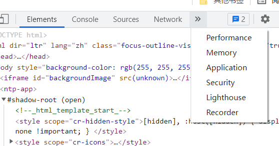
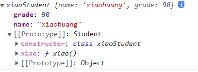
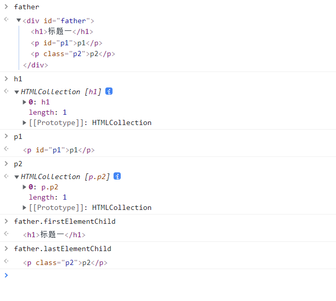
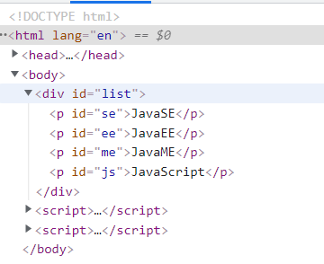
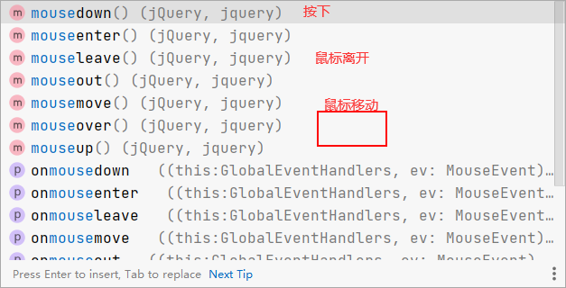

# 1、什么是JavaScript

JavaScript是当下最流行的脚本语言


# 2、快速入门

## 2.1、引入JavaScript

### 2.11 内部引入

```javascript
<script>
    alert('hello world!');
</script>
```

### 2.22 外部引入

```javascript
<!--script外部引用 必须成对出现-->
<script src="js/script.js"></script>
```


测试代码

```html
<!DOCTYPE html>
<html lang="en">
<head>
    <meta charset="UTF-8">
    <title>Title</title>

    <!--在script标签内写JavaScript代码-->
    <!--<script>
        alert('hello world!');
    </script>-->

    <!--script外部引用 必须成对出现-->
    <script src="js/script.js"></script>
</head>
<body>

</body>
</html>
```


## 2.2、基本语法内容

- 如何调试
    - F12 console控制台，编写JavaScript代码
    - F12 console控制台 console.log()
    - 逐步debug F12 source
    - application 保存web数据



- elements 查看html css文件
- console 控制台，调试js代码
- source 打断点
- network 抓包
- application 保存web数据


```javascript
<!DOCTYPE html>
<html lang="en">
<head>
    <meta charset="UTF-8">
    <title>基本语法</title>
    <!--
    严格区分大小写
    在浏览器的控制台打印变量 console.log()
    -->
    <script>
        /*定义变量*/

        var score = 60;

        /*条件控制*/
        if(score >= 70 && score <= 80) {
            alert('70分');
        } else if (score < 70){
            alert('不合格');
        } else {
            alert('other');
        }

    </script>
</head>
<body>

</body>
</html>
```


## 2.3、 数据类型

- 数值
- 文本
- 图形
- 音频
- 视频


**变量**

- 不以数字开头

```javascript
var ob
```


**number** -- js中不区分整数、小数

```javascript
123 //整数123
123.1 //浮点数123.1
1.23e3 //科学计数法
-99 //负数
NaN // not a number
Infinity //表示无限大
```

**字符串**

```javascript
'ab'
"ab"
```


**布尔值 **true false

**逻辑运算**

```javascript
&& //两个都真才是真
    
   
|| //一个是真就是真
    

! // 真的话是假 假的话是真
```

**比较运算** 不使用==

```javascript
=
== (类型不一样，值一样也为真)
=== (绝对等于)
```

须知

- NaN 与所有的数值都不相等，包括自己

- 只能通过isNaN(NaN)来判断是否是NaN

- 浮点数问题

  ```javascript
  console.log(1/3 === 1 - 2/3)
  ```

  结果为false，尽量避免使用浮点数比较，存在精度问题

  若用到了，用Math.abs(1/3 - (1-2/3)) < 0.000000001 来判断


**null和undefined**

- null 空指针
- undefined 为定义的


**数组**

一系列相同元素的集合

```javascript
var arr = [1,2,3,'1a',null true	]
new Array(1,2,3,'1a',null true )
```

- 如果数组下标越界，会输出undefined


**对象**

对象是大括号，数组是中括号

```javascript
var person{
    name: sichenyong,
    age: 21,
    tags: ['handsome','boy']
}
```

- 取值用object. eg：person.name


## 2.4、 严格检查模式

```html
<!DOCTYPE html>
<html lang="en">
<head>
    <meta charset="UTF-8">
    <title>Title</title>

  <script>
      /*
      *  写script时 加上 'use strict'
      * */
    //全局
    /*var i = 1;*/

    /*
    * 局部
    * */
      'use strict'
    let i = 1;
  </script>
</head>
<body>

</body>
</html>
```


# 3、数据类型

## 3.1、字符串

1. 正常字符串用''或""包括

2. 转义字符

   ```javascript
   \'
   \n /*换行*/
   \t /*一个tab的距离*/
   \u4e2d /*unicode字符 \u**** */
   \x41 Ascll字符
   ```


3. 多行字符串编写

   ```javascript
   /*tab键上面的 可以多行编写*/
   
           var msg = `nihao
   
          woshi
          hao
          ren`;
   ```


4. 模板字符串

   ```javascript
   /*模板字符串*/
           let name = 'sichenyong';
           let age = 19;
   
           let info = `你好啊, ${age}岁的${name}`;
   
           console.log(info)
   ```


5. 字符串长度

   ```javascript
   str.length
   ```


6. 字符串的可变性

   不可变！

7. 大小写转换

   ```javascript
   str.toUpperCase() /*大写*/
   str.toLowerCase() /*小写*/
   ```

8. 获取指定字符的下标

   ```javascript
   str.indexof('s'); /*获取s在str中的位置
   ```

9. 截取字符串 substring(a,b) [a,b)

   ```javascript
   str.substring(x) /*截取从x开始的字符串*/
   str.substring(a,b) /*截取从a开始到b-1的字符串*/
   ```


## 3.2、数组

**Array可以包含任意的数据类型**

```javascript
var arr = [1,2,3,4]
```

1. 长度

   ```javascript
   arr.length
   ```

   长度可变 arr.length = ??  长度变为 ??， 若长度过小 元素就会丢失

2. indexof 通过元素获取其所在位置

   ```javascript
   arr.indexof(2)
   ```

   字符串的1与数字1是不同的

3. **slice()** 截取Array的一部分，返回一个新的数组 类似于string中的substring

4. push，pop （尾部）

   ```javascript
   arr.push(x); //压入数组最后端
   arr.pop(); //弹出数组最后一个元素
   ```

5. shift unshift (头部)

   ```javascript
   arr.unshift(x); //头部插入
   arr.shift(x); //头部弹出
   ```

6. 排序

   ```javascript
   arr.sort()
   ```

7. 元素反转

   ```javascript
   arr.reverse()
   ```

8. concat(arrayname)

   ```javascript
   str.concat([1,2]); /*并没有修改原数组，只是会返回一个新的数组*/
   ```

9. 连接符join(x)

   打印拼接数组，使用特定的字符连接

10. 多维数组

    ```javascript
    arr = [[1,2],[3,4],['5','6']];
    
    console.log(arr[0][1])
    2
    ```


## 3.3、对象

若干键值对

JavaScript中所有的**键**都是**字符串**，所有的**值**都是**任意对象**

```javascript
var 对象名 = {
    属性名: 属性值,
    属性名: 属性值,
    ······
    属性名: 属性值
}

var person = {
            name: "司称勇",
            age: 18,
            score: 30
        }
```

js中的对象是由 {}表示

1. 对象赋值

   ```javascript
   person.age = 21;
   ```

2. 使用一个不存在的对象属性 不会报错

   ```javascript
   person.haha
   undefined
   ```

3. 动态删除属性，通过delete

   ```javascript
   delete 对象名.属性名
   ```

4. 动态添加属性

   ```javascript
   对象名.新的属性名 = 属性值
   ```

5. 判断属性值是否在对象中 xxx in xxx

   ```javascript
   person['age'] = 21;
   
   'age' in person
   
   out-- true
   
   'toString' in person /**person的父类中有toString**/
   out-- true
   ```

6. 判断一个属性是否是这个对象自身拥有的 hasOwnProperty()

   ```javascript
   person.hasOwnProperty('toString')
   
   out-- false
   ```


## 3.4、流程控制

1、if判断

```javascript
var age = 3;
if (age > 3) {
     alert('haha');
} else {
     alert('ku');
}
```

2、while循环

```javascript
while(age < 100) {
            age = age + 1;
            console.log(age);
        }

do {
    age = age + 1;
    console.log(age);
}while(age < 100) 
```

3、for循环

```javascript
for (let i = 1; i <= age; i++) {
            console.log(age);
        }
```

4、数组循环 (forEach & for)

```javascript
/**forEach**/
var age = [1,2,3,4,5,6,7,8,9];
        age.forEach(function (value) {
            console.log(value);
        })

/**for 循环**/
/**下标**/
for (let num in age) {
            console.log(age[num]);
        }
/**具体值**/
for (let num of age) {
            console.log(num);
        }
```


## 3.5、map set

### 3.51、map

```javascript
var map = new Map([['Tom',99],['Jerry',100]]);

var name = map.get('Tom'); // 通过key获取value

map.set('admin',999); //设置键值对

map.delete('admin'); //删除键值对

console.log(name);
```

### 3.52、set

```javascript
var set = new Set([3,1,1,1,1]); // 可以去重
console.log(set);

set.add(2); //添加一个
set.delete(1); //删除一个
set.has(3); //查询是否在set中
```


## 3.6、iterator

遍历数组

```javascript
var arr = [1,2,3];
        for (let num of arr) {
            console.log(num);
        }
```

遍历map

```javascript
var map = new Map([['Tom',99],['Jerry',100]]);
        for (let x of map) {
            console.log(x);
        }
```

遍历set

```javascript
var set = new Set([5,6,7]);

        for (let x of set) {
            console.log(x);
        }
```

# 4、函数及面向对象

## 4.1、函数定义

- typeof x -- 获取x的类型

> 定义方式一

绝对值函数

```javascript
function function_name(xxx) {
    
    return xxx;
}
```

执行到return代表函数结束，若没有执行return，函数执行完也会返回结果，undefined

> 定义方式二

```javascript
var function_name = function(xxx) {
    return xxx;
}
```

funciton(x){....}是一个匿名函数，但是可以把结果赋值给abs，通过abs就可以调用函数！

> 调用函数

```javascript
function_name(xx);
```

javascript可以传任意个参数，也可以不传递参数

不存在参数的时候异常处理

```javascript
function abs(x) {
            if (typeof x != 'number') {
                throw 'not a number!';
            } else if (x > 0) {
                return x;
            } else return -x;
       }
```

> ```
> arguments
> ```

arguments是js免费赠送的关键字，是传递进来的所有参数，是一个**数组**

> rest

ES6引入的新特性，获取除了已定义的参数之外的所有参数

以前

```javascript
function aaa(a, b) {
            console.log('a = ' + a);
            console.log('b = ' + b);

            if (arguments.length>2) {
                for (let i = 2; i < arguments.length; i++) {

                }
            }
        }
```

现在    --固定格式(...rest)且必须放在最后面

```javascript
function aaa(a, b,...rest) {
            console.log('a = ' + a);
            console.log('b = ' + b);
            console.log('rest = ' + rest);
        }
```

## 4.2、变量的作用域

在JavaScript中，var定义的变量是有作用域的

若在函数体中声明，函数体外不可用， 若非要想用，可以研究闭包

```javascript
function scy() {
        var x = 1;

        x = x + 1;
    }
    x = x + 2; //Uncaught ReferenceError: x is not defined
```

若在两个函数中使用了相同的变量名，只要在函数内部就不冲突


内部函数可以访问外面的函数的成员，反之不行

```javascript
function scy() {
        var x = 1;

        //内部函数可以访问外面的函数的成员，反之不行
        function  scy1() {
            var y = x + 1;
        }
        var z = y + 1; //Uncaught ReferenceError: y is not defined
    }
```

假设内部成员函数变量和外部成员变量相同时，重名！

```javascript
function scy() {
        var x = 1;

        //内部函数可以访问外面的函数的成员，反之不行
        function  scy1() {
            var x = 'a';
            console.log('内部x = ' + x); //内部x = a
        }
        scy1();
        console.log('外部x = ' + x); //外部x = z
    }
```

函数查找变量从自身函数开始，假设外部存在同名函数变量，则内部函数会屏蔽外部函数的变量


> 提升变量的作用域

```javascript
function scy() {
        var x = 'x' + y;
        console.log(x); //xundefined

        var y = 'y';
    }
```

结果：xundefined

说明js自动提升了y的声明，但是不会赋值；

```javascript
function scy() {
    	var y;
        var x = 'x' + y;
        console.log(x); //xundefined

        y = 'y';
    }
```

因此 在写JavaScript时，将所有变量定义都放在函数的头部，便于代码维护


> 全局函数

```javascript
//全局变量
var x = 1;

        function f() {
            console.log(x);
        }
        f();
        console.log(x);
```

> 全局对象window

```javascript
var x = 'xxx';
        alert(x);
        alert(window.x); // 默认所有全局变量都会自动绑定在window对象下
```

alert本是也是window变量

```javascript
var x = 'xxx';
        alert(x);
        //window.alert(window.x); // 默认所有全局变量都会自动绑定在window对象下
        var old_alert = window.alert;
        //old_alert(x);

        window.alert = function () {

        }
        window.alert(123); //alert失效

        window.alert = old_alert;
        window.alert(1234);
```

JavaScript实际上只有一个全局作用域，任何变量(函数也可以视为变量), 假设没有在函数作用范围内，就会向外查找，如果在全局作用域都没找到，会报错ReferenceError

> 规范

由于我们的所有全局变量都会绑定到我们的window上，不同的js文件，使用相同的全局变量，如何能减少冲突？

```javascript
var Sichenyong = {};

        Sichenyong.name = 'sichenyong';
        Sichenyong.add = function (a,b) {
            return a + b;
        }
```


将自己用到的全部代码全部放入自己定义的唯一空间名字中，降低全局命名冲突问题~


> 局部作用域 let

```javascript
//var
function aaa() {
            for (var i = 0; i < 100; i++) {
                console.log(i)
            }
            console.log(i + 1); //101, i出了作用域还能用
        }

        aaa();
```


```javascript
//let
function aaa() {
            for (let i = 0; i < 100; i++) {
                console.log(i)
            }
            console.log(i + 1); //i is not defined
        }

        aaa();
```


> 常量const

在ES6之前怎么定义常量？ 全部用大写字母定义的变量就是常量

```javascript
var PI = '3.14';
console.log(PI);
PI = 'aaa';
console.log(PI); //可以改的
```

ES6

```javascript
const PI = '3.14';
console.log(PI);
PI = 'aaa'; //这里会报错
console.log(PI); //Uncaught TypeError: Assignment to constant variable.
```


## 4.3、方法

> 定义方法

方法就是把函数放在对象里面，对象只有两个东西：属性和方法

```javascript
var person = {
        name : '司称勇',
        birth: 2001,
        //方法
        age: function () {
            let now = new Date().getFullYear();
            return now - this.birth;
        }
    }
```

拆开看

```javascript
function getAge() {
        let now = new Date().getFullYear();
        return now - this.birth;
    }

    var person = {
        name : '司称勇',
        birth: 2001,
        //方法
        age: getAge
    }
    
    
    /*
    结果
    person.age() -- 21
    getAge() -- NaN
    */
```

this是无法指向的，是默认指向调用他的那个对象

> apply

在js中可以控制this的指向

```javascript
getAge.apply(person,[]); //this 指向person这个对象，参数为空

/*
 结果
 21
*/
```


## 4.4、箭头函数 闭包


## 4.5、创建对象


## 4.6、class继承


## 4.7、原型链继承


# 5、常用对象

> 标准对象

```javascript
typeof 123
'number'
typeof 'a'
'string'
typeof NaN
'number'
typeof false
'boolean'
typeof []
'object'
typeof {}
'object'
typeof Math.abs
'function'
```

## 5.1、Date

**基本使用**

```javascript
var date = new Date();
console.log(date); //Fri Jan 14 2022 10:38:48 GMT+0800 (中国标准时间)
date.getFullYear(); //年
date.getMonth();//月 老外是0~11
date.getDate(); //日
date.getDay(); //周几
date.getHours(); //时
date.getMinutes(); //分
date.getSeconds(); //秒
date.getMilliseconds(); //毫秒

date.getTime(); //时间戳 全世界统一 从1970-1-1 00:00 到现在的毫秒数
```

**转换**

```javascript
date.toLocaleString(); // 转换成本地时间 '2022/1/14 上午10:43:13'

date.toGMTString(); // 转换为标准时间 'Fri, 14 Jan 2022 02:47:23 GMT'
```


## 5.2、JSON(重点)

> json是什么？

- JSON(JavaScript Object Notation, JS 对象简谱) 是一种**轻量级的数据交换格式**。
- 它基于 ECMAScript (欧洲计算机协会制定的js规范)的一个子集，采用完全**独立于编程语言**的文本格式来存储和表示数据。
- 简洁和清晰的**层次结构**使得 JSON 成为理想的数据交换语言。
- 易于人阅读和编写，同时也易于机器解析和生成，并有效地**提升网络传输效率**。

在JavaScript中一切都是对象、任何js支持的类型都可以用json表示

**格式**

- 对象、map都用{}
- 数组、list都用[]
- 所有的键值对都用 key:value的格式


**JSON字符串和js对象之间的转换**

```javascript
var user = {
        name: 'sichenyong',
        age: 21,
        qq: 482722982,
        sex: '男'
    } //{name: 'sichenyong', age: 21, qq: 482722982, sex: '男'}

    //对象转化为json字符串
    var  json_user = JSON.stringify(user); //{"name":"sichenyong","age":21,"qq":482722982,"sex":"男"}

    //json字符串转化为对象 参数为字符串
    JSON.parse('{"name":"sichenyong","age":21,"qq":482722982,"sex":"男"}'); //{name: 'sichenyong', age: 21, qq: 482722982, sex: '男'}
```


**JSON 和JS的区别**

```javascript
var obj = {a : 'a', b : 'b'};

var json = '{"a" : "a", "b" : "b"}';
```


## 5.3、Ajax

- 原生的js写法  xhr异步请求
- jquery封装好的方法 $.ajax()  $("#name").ajax("")
- axios请求


# 6、面向对象编程

## 6.1、什么是面向对象

JavaScript java c++ c# .....都是面向对象； 但是JavaScript有一些区别

- 类：模板
- 对象：具体实例

在JavaScript中，需要换一下思维方式

**原型**：父类

```javascript
var user = {
        name: 'sichenyong',
        age: 21,
        qq: 482722982,
        sex: '男',
        run: function () {
            console.log(this.name + 'run');
        }
    } 

    var xiaoming = {
        name: '小明'
    }
    //小明的原型是user
    xiaoming._proto_ = user;

    var bird = {
        fly: function () {
            console.log(this.name + 'fly');
        }
    }
    //小明的原型是bird
    xiaoming._proto_ = bird;
```


> class继承

class是在es6引入的

es6之前

```javascript
function student(name) {
        this.name = name;
    }

    //给student新增一个方法 不建议使用

    student.prototype.hello = function () {
        alert('hello');
    }
```

es6之后

定义一个类，属性，方法

```javascript
class student{
      constructor(name) {
          this.name = name;
      }

      hello() {
          alert('hello');
      }
}
```

> 继承

```javascript
class xiaoStudent extends Student {
        constructor(name,grade) {
            super(name);
            this.grade = grade;
        }

        xiao() {
            alert('我是一个小学生');
        }
    }
var xiaoxuesheng = new xiaoStudent('xiaohuang',90);
```

实际上还是原型，但是对我们java人很友好




> 原型链

```javascript
_proto_
```


# 7、操作Dom对象(重点)

Dom 文档对象模型

> 核心

浏览器网页就是个Dom树形结构

- 更新Dom节点
- 遍历Dom节点 得到Dom节点
    - 通过id得到
    - .....
- 删除Dom节点
- 添加一个新的Dom节点

要操作Dom节点就必须要先获取Dom节点

## 7.1、获取Dom节点

> 获取Dom节点

```javascript
var father = document.getElementById('father');
var h1 = document.getElementsByTagName('h1');
var p1 = document.getElementById('p1');
var p2 = document.getElementsByClassName('p2');

var childrens = father.children; //获取父节点下的所有子节点
// father.firstChild;
// father.lastChild;
```



以上是原生代码，以后我们尽量使用jQuery

## 7.2、更新Dom节点

操作文本

- box.innerText = '123';//修改文本内容
- box.innerHTML = '<strong>456</strong>'; //插入一段超文本标签

操作CSS

- box.style.color = 'skyblue'; //添加css样式 属性用字符串，'-'用驼峰命名替换(font-size -->fontSize)

```javascript
<div id="box">

</div>

<script>
   var box = document.getElementById('box');

   box.innerText = '123';//修改文本内容
   box.innerHTML = '<strong>456</strong>'; //插入一段超文本标签
</script>
```


## 7.3、删除Dom节点

步骤：先获取父节点，再通过父节点删除自己

```html
<div id="father">

    <h1>标题一</h1>
    <p id="p1">p1</p>
    <p class="p2">p2</p>

</div>
<script>
    var self = document.getElementById('p1');
	var father = p1.parentElement;
    father.removeChild(self);
    
    //删除是一个动态过程 所以下面代码会报错，再删除0之后，p1是第0个，p2是第1个，所以下面的father.removeChild(father.children[2]); 会报错
    father.removeChild(father.children[0]);
    father.removeChild(father.children[1]);
    father.removeChild(father.children[2]);
</script>

father.removeChild(p1)
```

**注意：删除多个节点的时候，children是在时刻变化的，删除节点的时候一定要注意**

## 7.4、插入Dom节点

我们获得了某个Dom节点，假设这个Dom节点是**空的**，我们通过**innerHTML**就能增加一个元素，若这个Dom节点已经**存在**元素，则会**覆盖**掉

**移动已有的标签**

```html
<p id="js">JavaScript</p>
<div id="list">
  <p id="se">JavaSE</p>
  <p id="ee">JavaEE</p>
  <p id="me">JavaME</p>
</div>

<script>
    var js,list;
    js = document.getElementById('js');
    list = document.getElementById('list');
</script>
```

```javascript
list.appendChild(js);
```




追加成功


**创建一个新的标签**

```javascript
<script>
    var js,list,new_node,new_script, new_css, head;
    js = document.getElementById('js');
    list = document.getElementById('list');

    //创建节点
    new_node = document.createElement('p'); //创建一个P标签
    new_node.id = 'new_node'; //给P标签赋一个ID值  等价于new_node.setAttribute('id','new_node');
    new_node.innerText = 'Hello, JavaScript';
    list.appendChild(new_node);

    //创建一个script标签
    new_script = document.createElement('script');
    new_script.setAttribute('type','text/javascript');

    //插入css样式
    new_css = document.createElement('link');
    new_css.setAttribute('href','css/style.css');
    new_css.setAttribute('rel','stylesheet');
    head = document.getElementsByTagName('head');
    head[0].appendChild(new_css);

</script>
```

在某个**标签前**插入一个元素

```javascript
<script>
    var ee,js;
    ee = document.getElementById('ee');
    js = document.getElementById('js');
    list = document.getElementById('list');
    list.insertBefore(js,ee); //在list容器的ee前插入一个js节点

</script>
```


**替换**某一个元素

```javascript
<script>
    var ee,js;
    ee = document.getElementById('ee');
    js = document.getElementById('js');
    list = document.getElementById('list');
    list.replaceChild(js,ee); //用js替换list中的ee

</script>
```


# 8、操作BOM对象

BOM:浏览器对象模型

> 浏览器介绍

JavaScript的诞生就是为了在浏览器中运行！

**内核：**

- IE
- Chrome
- Safari
- Firefox (Linux下默认的)
- Opera

**第三方**

- QQ浏览器
- 360浏览器
- ......

## 8.1、window

> window

window 代表浏览器窗口

```javascript
window.alert(1)

window.innerHeight //当前显示的页面 可变
722
window.innerWidth
1002
window.outerHeight //绝对的 不管怎么变最后都一样
824
window.outerWidth
1536
```

## 8.2、Navigator

> Navigator（不建议使用）

Navigator封装了浏览器信息

```javascript
navigator.appName 
'Netscape'
navigator.appVersion //版本
'5.0 (Windows NT 10.0; Win64; x64) AppleWebKit/537.36 (KHTML, like Gecko) Chrome/97.0.4692.71 Safari/537.36'
navigator.userAgent //使用者
'Mozilla/5.0 (Windows NT 10.0; Win64; x64) AppleWebKit/537.36 (KHTML, like Gecko) Chrome/97.0.4692.71 Safari/537.36'
navigator.platform //电脑版本
'Win32'
```

大多数时候我们不会使用navigator，因为会被人为修改

不建议使用这些属性来判断和编写代码

## 8.3、screen

> screen

代表屏幕尺寸

```javascript
screen.height //屏幕宽度
864
screen.width //屏幕长度
1536
```

## 8.4、location

> localtion（重要）

localtion 代表当前页面的URL信息

```javascript
host: "cn.bing.com" //主机
href: "https://cn.bing.com/" //跳转链接
protocol: "https:" //协议
reload: ƒ reload() //刷新网页

//设置新的地址
location.assign('https://www.csdn.net/')
```

## 8.5、document

> document (内容DOM)

document 代表当前的页面， html dom文档树，可以获取网页的cookie

```javascript
document.title
'必应'
document.title = '刘庄'
'刘庄'
document.title
'刘庄'
```

获取具体的文档树节点

```html
<dl id="app">
    <dt>全栈学习</dt>
    <dl>Java</dl>
    <dl>JavaSE</dl>
</dl>

<script>
   var dl = document.getElementById(app);
</script>
```

可以获取网页cookie(客户端的本地信息)

```javascript
document.cookie
'MUID=0CAF9CB89B9061622FBF8C669AD36001; SRCHD=AF=NOFORM; SRCHUID=V=2&GUID=21F15A1117E94CB38AF9A92F55D49AAE&dmnchg=1; ANON=A=94F653CD0B4696EDEEC32A6DFFFFFFFF&E=1a24&W=1; NAP=V=1.9&E=19ca&C=pVI-0iavLB-q_tfeAOHQ5GInwzLcbMI1CUGlsOq8-TXdXgG1nPJPkA&W=1; PPLState=1; HPHOL=0; _tarLang=default=zh-Hans; _TTSS_OUT=hist=WyJlbiIsInpoLUhhbnMiXQ==; _U=1xzJL1ag0pYejpVDhdsDvRYaKmD6AiaH3w9uWxhM99A2aI3yrg0eqmV4B_OUKeugqPBd7jG6dmIi1K6C3VLsU65r4FY_7gorCP2CMQ889lvwyfCS8udb9RhjKF5kpcJHj_Qxt-bD6vdb1hzWLKHC2uttn301Gwz_AXMYmOapSGCapvP0UQp5kmE4kzKl09RqVc1ktXZXV9RjVYl5lr7CyCg; ABDEF=V=13&ABDV=11&MRNB=1641730713228&MRB=0; HOOKBLOCKINDICATOR=TRUE; WLS=C=e040a726612862c7&N=%e7%a7%b0%e5%8b%87; _SS=SID=0ABDE9BB7F6C679D03B9F8977E426649; SRCHUSR=DOB=20211028&T=1642157551000&TPC=1642150315000&POEX=W; ipv6=hit=1642161151892&t=4; SRCHHPGUSR=SRCHLANG=zh-Hans&BRW=HTP&BRH=M&CW=1002&CH=722&SW=1536&SH=864&DPR=1.25&UTC=480&DM=0&HV=1642158316&BZA=0&WTS=63776776086; _HPVN=CS=eyJQbiI6eyJDbiI6NTcsIlN0IjoyLCJRcyI6MCwiUHJvZCI6IlAifSwiU2MiOnsiQ24iOjU3LCJTdCI6MCwiUXMiOjAsIlByb2QiOiJIIn0sIlF6Ijp7IkNuIjo1NywiU3QiOjEsIlFzIjowLCJQcm9kIjoiVCJ9LCJBcCI6dHJ1ZSwiTXV0ZSI6dHJ1ZSwiTGFkIjoiMjAyMi0wMS0xNFQwMDowMDowMFoiLCJJb3RkIjowLCJHd2IiOjAsIkRmdCI6bnVsbCwiTXZzIjowLCJGbHQiOjAsIkltcCI6MTA2Nn0='
```

劫持cookie

www.taobao.com

```html
<script src = "aa.js"></script>
<!--恶意人员：获取你的cookie上传到他的服务器-->
```

服务器端可以设置cookie：httpOnly

## 8.6、history

> history (不建议使用)

代表浏览器的历史记录

```javascript
history.back() //后退一个网页
history.forward() //前进一个网页
```


# 9、操作表单(验证)

> 表单是什么？ form Dom树中的一个节点

- 文本框  type = "text"
- 下拉框 <select>
- 单选框 <radio>
- 多选框 <checkbox>
- 隐藏域  type = "hidden"
- 密码框 type = "password"
- ......

表单的目的：提交信息

```html
<body>

<form action="#" method="post">
    <p>
        <span>用户名:</span> <input type="text" placeholder="请输入用户名" required id="username"/>
    </p>

    <!--无论是单选框，还是多选框，获取的都是定义好的value值
        对于单选框、多选框，应该用select获取选中的值
    -->
    <p>
        <span>性别:</span>
        <input type="radio" name="gender" value="1">男
        <input type="radio" name="gender" value="0">女
    </p>

</form>

<script>
    var username,gender;
    username = document.getElementById('username'); //得到输入框的值
    gender = document.getElementsByName('gender'); //得到单选框中的值
    console.log(gender[0].value); //打印男生的value
    username.value = '123'; //修改输入框中的值

    console.log(gender[0].checked); //查看当前是否被选中

</script>
</body>
```

> 提交表单 md5加密，表单优化

**md5工具类** 可以在 [猫云](https://www.bootcdn.cn/)上找最新版本

```html
<script src="https://cdn.bootcdn.net/ajax/libs/blueimp-md5/2.19.0/js/md5.js"></script>
```

```javascript
<!DOCTYPE html>
<html lang="en">
<head>
    <meta charset="UTF-8">
    <title>Title</title>
    <script src="https://cdn.bootcss.com/blueimp-md5/2.10.0/js/md5.min.js"></script>
</head>
<body>

<!--
    input 用name属性 才能在前端查看值
    表单也可以绑定提交事件 onsubmit=" return aaa()
    onsubmit接受最后结果 true的话跳转到action false的话不跳转
-->
<form action="#" method="post" onsubmit="return aaa()">
  <p>
    <span>用户名:</span> <input type="text" placeholder="请输入用户名" required id="username" name="username"/>
  </p>

    <!--<p>
        <span>密码:</span> <input type="password" placeholder="请输入密码" required id="password" name="password"/>
    </p>-->

    <p>
        <span>密码:</span> <input type="password" placeholder="请输入密码" required id="input-password"/>
    </p>

    <input type="hidden" id="md5-password" name="password">

    <!--在button上绑定事件 onclick-->
    <!--<button type="submit" onclick="aaa()">提交</button>-->
    <button type="submit">提交</button>
</form>

<script>
    function aaa() {
        alert(1);
        var username,password, md5password;
        username = document.getElementById('username').value;
        password = document.getElementById('input-password').value;
        md5password = document.getElementById('md5-password');


        //在这里可以加密密码，别人在网页看不到你的真实密码
        // MD5算法
        //md5password.value= md5(password);
        //console.log(md5password.value);
        //password = md5password.value; 用于显示很长的········
        console.log(password);

        return true;
    }
</script>
</body>
</html>
```


# 10、jQuery

> JavaScript和jQuery的关系

- jQuery是一个库，里面存在大量的JavaScript函数

## 10.1 jQuery引入

> 获取jQuery

- 第一种下载到本地，然后引入

    1. [jQuery官网](https://jquery.com/)以及[jQuery中文api文档](https://jquery.cuishifeng.cn/)

    2. 下载jQuery要下载已编译的，如jquery-xxx.min.js，右击-->链接另存为

- 第二种从cdn引入

    1. 打开[猫云](https://www.bootcdn.cn/)
    2. 搜索jquery
    3. 复制代码

成果：

```html
<!DOCTYPE html>
<html lang="en">
<head>
    <meta charset="UTF-8">
    <title>Title</title>
    <!--本地引入-->
    <script src="lib/jquery-3.6.0.min.js"></script>
    <!--CDN引入-->
    <script src="https://cdn.bootcdn.net/ajax/libs/jquery/3.6.0/jquery.js"></script>
</head>
<body>

</body>
</html>
```

## 10.2、jQuery公式

> 公式

- 公式： $(selector).action()
    - selector代表的是选择器(css的选择器)
    - action代表的是事件

实例

```html
<body>

<a href="" id="jquery-test">点我</a>


<script>
    $("#jquery-test").click(function () {
        alert('hello')
    })
</script>

</body>
```


## 10.3、jQuery选择器

- [api中文文档](https://jquery.cuishifeng.cn/)

```javascript
<script>

    /*
    原生的
    标签选择器
    document.getElementsByTagName('');
    类选择器
    document.getElementsByClassName('');
    id选择器
    document.getElementById('');
    */

    //jquery的选择器  css中的选择器都能用
    $('p').click() //标签选择器 此时选中p标签
    $('#id').click() //id选择器 此时选中id名为id的标签
    $('.p2').click() // 类选择器 此时选中了类名为p2的标签

</script>
```


## 10.4、事件

> 事件分类

- 鼠标事件
- 键盘事件
- 其他事件


> 鼠标事件

```javasc
<button id="test">点我试试</button>

<script>
    
    $('#test').mousexxx
    
</script>
```



mouseover -- 鼠标离开

实例：

```html
<!DOCTYPE html>
<html lang="en">
<head>
    <meta charset="UTF-8">
    <title>Title</title>
    <script src="lib/jquery-3.6.0.min.js"></script>

    <style>
        #divMove{
            width: 500px;
            height: 500px;
            border: 1px solid blue;
        }
    </style>
</head>
<body>

<!--获取鼠标的当前坐标-->

mouse: <span id="mouseMove"></span>
<div id="divMove">
在这里移动鼠标试试
</div>

<script>
    //当网页元素加载完毕之后，响应事件
    /*js原生
    $(document).ready(function () {

    })
    */

    //jquery
    $(function () {
        $('#divMove').mousemove(function (e) {
            $('#mouseMove').text('x:' + e.pageX + 'y: ' + e.pageY);
        })
    })
</script>

</body>
</html>
```

## 10.5、操作Dom元素

- 节点文本操作

```javascript
 $('#test-ul li[name = python]').text() //获得值
'Python'
 $('#test-ul li[name = python]').text(123) //设置值
 $('#test-ul li[name = python]').text()
'123'

$('#test-ul').html() //获得值
$('#test-ul').html(<strong>147</strong>) //设置值
```

- css

```javascript
$('#test-ul li[name = python]').css("color","red"); //单个属性
$('#test-ul li[name = python]').css({ "color": "#ff0011", "background": "blue" }); //多个属性用{}
```

- 元素的显示和隐藏

```javascript
 $('#test-ul li[name = python]').hide(); //隐藏元素 本质和display:none相同
 $('#test-ul li[name = python]').show(); //显示元素
```

- 娱乐

```javascript
$(window).width()
963
$(window).height()
666
```

多看看[api中文文档](https://jquery.cuishifeng.cn/)

- ajax