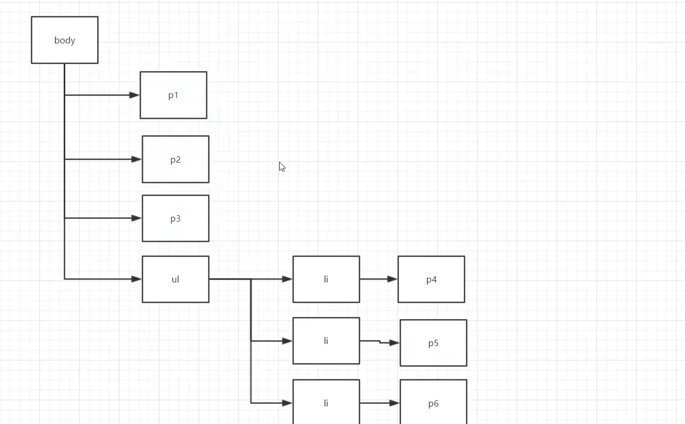
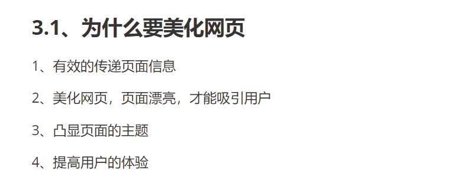
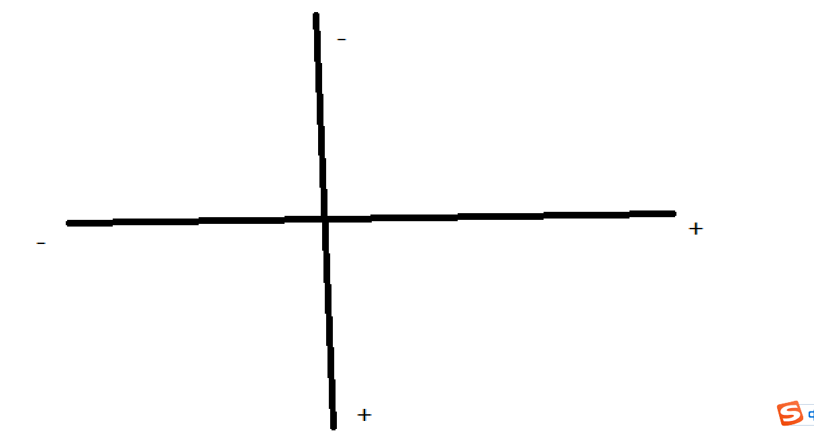
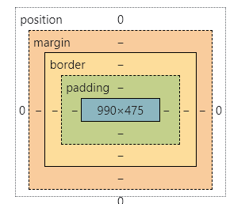
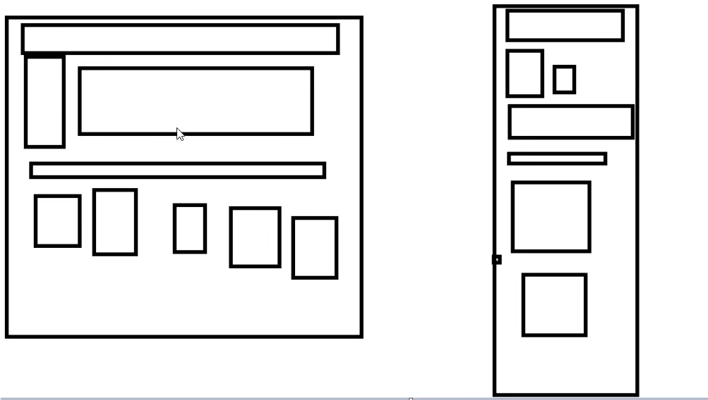

# 1. CSS导入方式

## 行内样式

```html
<h1 style="color: red">你好</h1>
```

## 内部样式

```html
    <!--内部样式-->
<style>
  h1{
    color: green;
  }
</style>
```

## 外部样式

```html
<!--外部样式-->
    <link rel="stylesheet" href="css/style.css">
```

```css
/*外部样式*/
h1{
    color: blue;
}
```

# 2. 三种基本选择器

## 2.1 标签选择器

```html
<style>
      h1{
          color: green;
      }
      p{
          font-size: 90px;
      }
  </style>

<h1>学习</h1>
<p>Java</p>
```

## 2.2 类选择器

- 格式：. + class后面的名称 +{}

```html
	<style>
        /**/
        .nihao{
            color: #7aff5b;
        }
        .hao{
            color: #ffc6ce;
        }
        .nv{
            color: #ff71a1;
        }
    </style>

<h1 class="nihao">你好</h1>
<h1 class="hao">好</h1>
<h1 class="nv">女</h1>
```

## 2.3 id选择器

- 格式：# +id名称 + {}

```html
	<style>
        #nihao{
            color: #ff71a1;
        }
    </style>
<h1 id="nihao">你好</h1>
```

## 2.4 关联

- 优先级 id > class > 标签
- id选择器 全局唯一
- 类选择器可以复用


# 3. 层次选择器

**层次图**



- 后代选择器
- 子类选择器
- 相邻兄弟选择器
- 通用选择器

## 3.1 后代选择器

- 格式：body + 标签类型 + {}
- 作用域：所有该标签

```css
	body p{
            color: #ff91b4;
        }
```

## 3.2 子类选择器

- 格式： body + > + 标签类型
- 作用域：body后的**一代**

```css
body>p{
            background: #ff71a1;
        }
```

## 3.3 相邻兄弟选择器

- 格式： . + class名称 + "+" + 标签类型
- 作用域：class名称所在标签的下一个标签

```css
.active + p{
            background: red;
        }
```

```html
<p class="active">p1</p>
  <p>p2</p>
  <p>p3</p>
```

## 3.4 通用选择器

- 格式：. + class名称 + "~" + 标签类型
- 作用域：class名称所在标签的后面所有标签

```css
.active~p{
            background: antiquewhite;
        }
```

```html
<p class="active">p1</p>
  <p>p2</p>
  <p>p3</p>
```


# 4. 结构伪类选择器

- 格式：标签类型 + ":" + 条件

- 例子

- body

  ```html
  <body>
    <p>p1</p>
    <p>p2</p>
    <p>p3</p>
  
    <ul>
        <li>li1</li>
        <li>li2</li>
        <li>li3</li>
    </ul>
  </body>
  ```

- 选中第一个li

  ```css
  /*选中ul中的第一个li*/
          ul li:first-child{
              background: aquamarine;
              color: #ff71a1;
          }
  ```

- 选中最后一个li

  ```css
  /*选中ul中的最后一个li*/
          ul li:last-child{
              background: #71a7ff;
              color: #ffc6ce;
          }
  ```

- 选中body中的第一个元素

  - 第一种

    - nth 选中当前类型的父层

    - p:nth-child(x) 选中p类型的父层，父层的第x个的孩子是p标签才生效

  ```css
   p:nth-child(1){
              background: antiquewhite;
          }
  ```

  - 第二种

    - p: nth-of-type(x) 选中p类型的父层，父层的第x的p标签生效

    ```css
    p:nth-of-type(2){
                background: #ffc6ce;
            }
    ```


# 5. 属性选择器（常用）

id +class 结合 = 属性选择器

- 几种等于符号
  - **=** --> 绝对等于
  - *= --> 通配符
  - ^= -->  通配符 前缀等于xx
  - $= --> 通配符 后缀等于xx

```html
<!DOCTYPE html>
<html lang="en">
<head>
    <meta charset="UTF-8">
    <title>属性选择器</title>

    <style>
        .demo a{
            float: left;
            display: block;
            height: 50px;
            width: 100px;
            border-radius: 10px;
            background: #831626;
            text-align: center;
            color: aqua;
            text-decoration: none;/*取消下划线*/
            margin-right: 5px; /*每个border右移*/
            font: bold 20px/50px Arial; /*字体大小/行高*/
        }

        /*
            = -- 绝对等于
            *= -- 通配符
            ^= -- 以这个开头
            $= -- 以这个结尾
        */

        /* 选中带有id属性的元素 (id所在标签)[]{}
            本例子中为 a[id]{}
        */
        /*a[id] {

        }*/

        /*选中id属性为first的标签
          (id标签所在)[id=first]{}
          本例子中为 a[id=first]{}
        */
        /*a[id=first] {

        }*/

        /*选中class属性中含有links的标签
        (class所在标签)[class*="xxxx"]{}
        本例子中为 a[class*="links"]{}
        */
        /*a[class*="links"] {
            background: blue;
        }*/

        /*选中href中 以http开头的
            正则表达式中用^=
        */
        /*a[href^=http] {
            color: red;
        }*/
        
        /*选中href中以html结尾的*/
        a[href$=html] {
            background: #ffc6ce;
        }
    </style>

</head>
<body>
    <p class="demo">
        <a href="https://www.baidu.com" class="links item first" id="first">百度</a>
        <a href="http://www.4399.com/" class="links item active" target="_blank" title="test">4399</a>
        <a href="https://www.layuiweb.com/" class="links item">layui</a>
        <a href="https://cn.pornhub.com/" class="links item">pornhub</a>
        <a href="https://txzqw.me/" class="links item">天下足球网</a>
        <a href="https://leetcode-cn.com/?utm_source=LCUS&utm_medium=ip_redirect&utm_campaign=transfer2china" class="links item">leetcode</a>
        <a href="https://getbootstrap.com/" class="links item">bootstrap</a>
        <a href="https://sa-token.dev33.cn/doc/index.html#/" class="links item">sa-token</a>
        <a href="https://www.acwing.com/problem/" class="links item">acwing</a>
        <a href="https://www.thymeleaf.org/doc/tutorials/3.0/usingthymeleaf.html" class="links item first">thymeleaf</a>
    </p>
</body>
</html>
```


# 6. 美化网页


## 6.1 为什么要美化网页




- 重点要突出的字用**span**标签套起来


```html
<!DOCTYPE html>
<html lang="en">
<head>
    <meta charset="UTF-8">
    <title>span标签学习</title>
    <style>
        #title1{
            font-size: 40px;
        }
    </style>
</head>
<body>
<span id="title1">全栈</span>学习
</body>
</html>
```

## 6.2 字体样式

```html
<!--
    font-family: 字体
    font-size: 字体大小
    font-weight: 字体粗细
    color: 字体颜色
    -->
    <style>
        body{
            font-family:"Times New Roman", 华文楷体;
        }

        h1{
            font-size: 50px;
            color: #ff71a1;
        }

        .p1{
            font-weight: bold;
        }
    </style>
```


## 6.3 文本样式

1. 颜色 color rgb rgba
2. 文本对齐方式 text-align
3. 首行缩进 text-indent: xem
4. 行高 line-height
5. 装饰 text-decoration(划线)
6. 文本图片水平对齐 vertical-align: middle


```html
<!DOCTYPE html>
<html lang="en">
<head>
    <meta charset="UTF-8">
    <title>万古神帝简介</title>

    <!--
    颜色：
        单词
        RGB （RED GREEN BLUE 对应 FF0000 00FF00 0000FF 自己调色）
        RGBA （A为透明度 a一般取值 0~1）
    排版 text-align
        center 居中
        left 左对齐
        right 右对齐
    缩进 text-indent xem
        1em = 一个字符
    行高和块高  一致的时候可以上下居中
        行高 line-height
        块高 height
    划线 text-decoration:
        上划钱 overline
        中划线 line-through
        下划线 underline
    -->
    <style>
        h1{
            color: rgba(63,189,255,0.4);
            text-align: center;
        }
        .p1{
            text-indent: 2em;
        }
        .p3{
            height: 30px;
            line-height: 30px;
        }
        .l1{
            text-decoration: underline;
        }

        .l2{
            text-decoration: line-through;
        }

        .l3{
            text-decoration: overline;
        }

        a{
            text-decoration: none;
        }
    </style>
</head>
<body>

<h1>作品简介</h1>
<hr/>
<p class="p1">
    八百年前，明帝之子张若尘，16岁时被未婚妻池瑶公主杀死，一代天骄，就此陨落。
</p>

<p class="l3">
    八百年后，张若尘重新活了过来，却发现曾经杀死他的未婚妻，已经统一昆仑界，开辟第一中央帝国，号称“池瑶女皇”。
</p>

<p class="l1">
    池瑶女皇——统御天下，威临八方；青春永驻，不死不灭。
</p>

<p class="l2">
    张若尘站在诸皇祠堂外，望着池瑶女皇的神像，心中燃烧起熊熊的仇恨烈焰，“待我重修十三年，敢叫女皇下黄泉”。
</p>
<a href="http://www.b520.cc/8_8187/" target="_blank">详情点击此处</a>

<hr/>
<h1>英文情诗</h1>
<p class="p3">
    Let me not to the marriage of true mindsAdmit impediments.Love is not loveWhich alters when it alteration finds,Or bends with the remover to remove:
</p>


</body>
</html>
```

图片与文字水平对齐

```html
<!DOCTYPE html>
<html lang="en">
<head>
    <meta charset="UTF-8">
    <title>Title</title>

    <!--
    水平对齐 a,b  a向b对齐
    -->
    <style>
        img,span{
            vertical-align: middle;
        }
    </style>
</head>
<body>

<p>
    
    <span>
        123456789
    </span>
</p>
</body>
</html>
```

## 6.4 超链接伪类及文字阴影

### 超链接伪类

- a:hover --> 鼠标悬停时
- a:active --> 按住未释放的链接
- a:visited -->  已访问的链接的
- a:link --> 未访问的链接


### 文字阴影

- text-shadow：水平阴影位置px +垂直阴影位置px +模糊的距离(可选)+ 阴影颜色(可选)




## 6.5 列表

```html
<!DOCTYPE html>
<html lang="en">
<head>
    <meta charset="UTF-8">
    <title>列表学习</title>

    <link rel="stylesheet" href="css/style.css">
</head>
<body>

<!--div 空标签-->
<div id="nav">
    <h2 class="title">全部商品分类</h2>

    <ul>
        <li>
            <a href="#">图书</a>
            <a href="#">音像</a>
            <a href="#">数字商品</a>
        </li>
        <li>
            <a href="#">家用电器</a>
            <a href="#">手机</a>
            <a href="#">数码</a>
        </li>
        <li>
            <a href="#">电脑</a>
            <a href="#">办公</a>
        </li>
        <li>
            <a href="#">家居</a>
            <a href="#">家装</a>
            <a href="#">厨具</a>
        </li>
        <li>
            <a href="#">服饰鞋帽</a>
            <a href="#">个性化妆</a>
        </li>
        <li>
            <a href="#">礼品箱包</a>
            <a href="#">钟表</a>
            <a href="#">珠宝</a>
        </li>
        <li>
            <a href="#">食品饮料</a>
            <a href="#">保健食品</a>
        </li>
        <li>
            <a href="#">彩票</a>
            <a href="#">旅行</a>
            <a href="#">充值</a>
            <a href="#">票务</a>
        </li>
    </ul>
</div>


</body>
</html>
```


style.css

```css
#nav{
    width: 300px;
    background: grey;
}

.title{
    font-size: 18px;
    font-weight: bold;
    line-height: 50px;
    text-indent: 1em;

    /*
   颜色 图片 图片位置 平铺方式
    */
    background: red url("../images/d.png") 270px 10px no-repeat;
}
/*list-style:
    none 去除前面的黑圆圈，有序列表的数字
    circle 空心圆
    decimal 数字
    square 正方形

*/

/*ul{
    background: grey;
}*/

ul li{
    height: 30px;
    list-style: none;
    text-indent: 1em;
    background-image: url("../images/r.png");
    background-repeat: no-repeat;
    background-position: 236px 2px;
}

a{
    text-decoration: none;
    color: black;
    font-size: 14px;
}
a:hover{
    color: orange;
    text-decoration: underline;
}
```


## 6.6 背景

- 背景颜色 background-color

- 背景图片 background-image

  ```css
  div {
      width: 409px;
      height: 203px;
      /*依次是 边框的粗细 边框的样式 边框的颜色*/
      border: 1px solid red;
      /*导入背景图片
        - 默认是全部平铺的 repeat
      */
      background-image: url("../images/1.png");
  }
  ```

  - 一些图片平铺

    ```css
    .div1{
        /*水平平铺*/
        background-repeat: repeat-x;
    }
    .div2{
        /*垂直平铺*/
        background-repeat: repeat-y;
    }
    .div3{
        /*不平铺*/
        background-repeat: no-repeat;
    }
    ```


## 6.7 渐变

- 网站：https://www.grabient.com/


# 7. 盒子模型

## 7.1 什么是盒子模型



- margin： 外边距 元素到嘴外边的距离
- border：边框
- padding： 内边距


## 7.2 边框

1. 边框的粗细
2. 边框的样式
3. 边框的颜色

```html
<!DOCTYPE html>
<html lang="en">
<head>
    <meta charset="UTF-8">
    <title>Title</title>

    <style>
        /*body 的margin默认是8 影响美观
            - 写的时候 可以将h ul li a body等标签的 padding margin设置为0
            */
        body{
            margin: 0;
            padding: 0;
            text-decoration: none;
        }
        /*border 粗细 样式 颜色*/
        #box{
            width: 300px;
            border: 1px solid red;
        }

        form{
            background: #3cbda6;
        }

        h2{
            font-size: 30px;
            background-color: #ff71a1;
            margin: 0;
            text-align: center;
        }

        div:nth-of-type(1) input{
            border: 3px solid black;
        }

        div:nth-of-type(2) input{
            border: 3px dashed blue;
        }
    </style>
</head>
<body>

<div id="box">
    <form action="#">
        <h2>会员登录</h2>
        <div>
            <span>姓名：</span>
            <input type="text">
        </div>

        <div>
            <span>密码：</span>
            <input type="text">
        </div>

        <div>
            <span>邮箱：</span>
            <input type="text">
        </div>
    </form>
</div>
</body>
</html>
```

## 7.3 外边距

- 外边距妙用 -- 居中
- margin : 上 右 下 左(1px 1px 1px 1px) 或 上下 左右(1px 1px)  所有的统一(1px)三种种
- margin-top 外边距的上部
- margin-bottom 外边距的下部
- margin-right 外边距的右部
- margin-left 外边距的左部


## 7.4 内边距

- padding
- padding:  上 右 下 左(1px 1px 1px 1px) 或 上下 左右(1px 1px)  所有的统一(1px)三种种


```html
<!DOCTYPE html>
<html lang="en">
<head>
    <meta charset="UTF-8">
    <title>Title</title>

    <style>
        /*body 的margin默认是8 影响美观
            - 写的时候 可以将h ul li a body等标签的 padding margin设置为0
            */
        body{
            margin: 0;
            padding: 0;
            text-decoration: none;
        }
        /*border 粗细 样式 颜色*/
        #box{
            width: 300px;
            border: 1px solid red;
            margin: 0 auto;
        }

        form{
            background: #3cbda6;
        }

        h2{
            font-size: 30px;
            background-color: #ff71a1;
            margin: 0;
            text-align: center;
        }

        input{
            border: 1px solid black;
        }
        
        div: nth-of-type(1) {
            padding: 1px;
        }
    </style>
</head>
<body>

<div id="box">
    <form action="#">
        <h2>会员登录</h2>
        <div>
            <span>姓名：</span>
            <input type="text">
        </div>

        <div>
            <span>密码：</span>
            <input type="text">
        </div>

        <div>
            <span>邮箱：</span>
            <input type="text">
        </div>
    </form>
</div>
</body>
</html>
```


## 7.5 盒子的计算方式

- size = margin + border + padding + 内容宽度
- 例如 给你 50*50px 是size = 50 而不是内容宽度


## 7.6 圆角边框

- border-radius: apx 四个角都是apx
- border-radius: apx bpx 左上右下是apx 左下右上是bpx
- border-radius: apx bpx cpx dpx 左上 右上 右下 左下
- 圆形 圆角 = 半径

```html
<!DOCTYPE html>
<html lang="en">
<head>
    <meta charset="UTF-8">
    <title>Title</title>

    <!--
    - border-radius: apx 四个角都是apx
    - border-radius: apx bpx 左上右下是apx 左下右上是bpx
    - border-radius: apx bpx cpx dpx 左上 右上 右下 左下
    - 圆形 圆角 = 半径
    -->
    <style>
        div{
            width: 100px;
            height: 100px;
            border: 10px solid #ff71a1;
            border-radius: 100px;
        }
    </style>
</head>
<body>
    <div></div>
</body>
</html>
```


## 7.7 阴影

```html
<!DOCTYPE html>
<html lang="en">
<head>
    <meta charset="UTF-8">
    <title>Title</title>

    <!--
    - box-shadow: xpx ypx apx color x轴y轴 模糊半径a 模糊颜色color
    - 居中 要求要存在块元素中 且块元素要有固定宽度
    -->
    <style>
        div{
            width: 100px;
            height: 100px;
            border: 10px solid #71a7ff;
            box-shadow: 10px 10px 1px red;
        }
    </style>
</head>
<body>
<div>

</div>
</body>
</html>
```


# 8. 浮动

## 8.1 标准文档流



- 块级元素
  - h1
  - h2
  - ...h6
  - p
  - div
  - 列表
- 行内元素
  - span
  - a
  - img
  - strong
  - ...

## 8.2 display

- display:
  - block 变成块元素
  - inline-block 既是块元素又是行内元素 ✔
  - inline 变成行内元素
  - none 不显示

```html
<!DOCTYPE html>
<html lang="en">
<head>
  <meta charset="UTF-8">
  <title>Title</title>

  /*
  display:
  - block 变成块元素
  - inline-block 既是块元素又是行内元素
  - inline 变成行内元素
  - none 不显示
  */
  <style>
    div{
      width: 100px;
      height: 100px;
      border: 10px solid red;
    }

    span{
      width: 100px;
      height: 100px;
      border: 10px solid blue;
      display: block;
    }
  </style>
</head>
<body>

<div>块元素</div>

<span>span行内元素</span>

</body>
</html>
```


## 8.3 浮动 float

- float:
  - right --向右浮动
  - left -- 向左浮动
  - bottom --向下浮动
  - top --向上浮动
  - none --不浮动
- clear 清楚浮动
  - both 清除选中的所有浮动

```html
<!DOCTYPE html>
<html lang="en">
<head>
  <meta charset="UTF-8">
  <title>浮动</title>
  <link rel="stylesheet" href="css/style.css" type="text/css">
</head>
<body>
<div id="father">
  <div class="layer01"></div>
  <div class="layer02"></div>
  <div class="layer03"></div>
  <div class="layer04">
    浮动的盒子可以向左滑动，也可以向右滑动，直到他的外边缘碰到包含框或另一个浮动的盒子为止
  </div>
</div>
</body>
</html>
```

```css
div{
  margin: 10px;
  padding: 5px;
}

#father{
  border: 1px solid #000;
}

.layer01{
  border: 1px dashed red;
  display: inline-block;
  float: right;
}

.layer02{
  border: 1px dashed blue;
  display: inline-block;
  float: right;
  clear: both;
}

.layer03{
  border: 1px dashed skyblue;
  display: inline-block;
}

.layer04{
  border: 1px dashed rgb(6,6,6);
  font-size: 12px;
  line-height: 23px;
}
```

## 8.4 父级边框塌陷的问题

- clear 清除浮动 若要浮动 另起一行
  - right 右侧不允许浮动
  - left 左侧不允许浮动
  - both 两侧都不允许浮动


解决

1. 增大父级元素高度

   ```css
   #father{
       border: 1px solid #000;
       height: 500px;
   }
   ```


2. 增加一个空div

   ```html
   <div class="clear"></div>
   ```

   ```css
   .clear{
   
       clear: both;
       margin: 0;
       padding: 0;
   }
   ```

3. 在父级元素中 增加一个overflow:hidden

  - hidden 超出的部分隐藏

  - scroll 滚动条

  - auto 当超出了，可以用浏览器的滚动条

4. 在父类添加一个伪类 after

   ```css
   #father:after{
       content: '';
       display: block;
       clear: both;
   }
   ```

### 小结

1. 增加父级元素的高度
2. 设置一个空div
3. overflow
4. 父类中加一个伪类 after(推荐)


## 对比

- display

  方向不能自己定，但是不用考虑父级边框塌陷的问题

- float

  可以自己定方向，但是需要考虑父级边框塌陷问题


# 9. 定位

## 9.1 相对定位

- position:relative

  相对原来的位置进行指定的偏移（仍然在标准文档中，原来的位置会被保留）

  - top
  - bottom
  - left
  - right

```html
<!DOCTYPE html>
<html lang="en">
<head>
    <meta charset="UTF-8">
    <title>相对定位</title>

    <!--相对自己原来的位置进行偏移-->
    <style>
        div{
            margin: 10px;
            padding: 5px;
            font-size: 12px;
            line-height: 25px;
        }

        #father{
            border: 1px solid black;
        }

        /*
        - position 相对原来的自己
        - relative 相对定位
        - top apx 距离原来的自己向下移动apx
        */
        #first{
            border: 1px dashed red;
            position: relative;
            top: -20px;
            left: 20px
        }

        #second{
            border: 1px dashed pink;
        }

        #third{
            border: 1px dashed purple;
        }
    </style>
</head>
<body>

<div id="father">
  <div id="first">第一个盒子</div>
  <div id="second">第二个盒子</div>
  <div id="third">第三个盒子</div>

</div>

</body>
</html>
```

## 9.2 绝对定位 absolute

基于xxx定位，上下左右

1. 没有父级元素定位的前提下，相对于浏览器定位
2. 假设父级元素存在定位，我们通常会相对于父级元素进行偏移
3. 在父级元素范围内移动

相对父级或浏览器的位置进行指定的偏移，绝对定位的话，他不在标准文档流中，原来的位置不会被保留

```html
<!DOCTYPE html>
<html lang="en">
<head>
    <meta charset="UTF-8">
    <title>绝对定位</title>

    <style>
        div{
            margin: 10px;
            padding: 5px;
            font-size: 12px;
            line-height: 25px;
        }

        #father{
            border: 1px solid black;
            position: relative;
        }

        #first{
            border: 1px dashed red;
        }

        #second{
            border: 1px dashed pink;
            position: absolute;
            right: 30px;
        }

        #third{
            border: 1px dashed purple;
        }
    </style>
</head>
<body>

<div id="father">
  <div id="first">第一个盒子</div>
  <div id="second">第二个盒子</div>
  <div id="third">第三个盒子</div>

</div>

</body>
</html>
```


## 9.3 固定定位 fixed

固定定位是定死了的 滑动浏览器也不会动


```html
<!DOCTYPE html>
<html lang="en">
<head>
    <meta charset="UTF-8">
    <title>固定定位</title>

    <style>
        body{
            height: 1000px;
        }

        div:nth-of-type(1) {
            width: 100px;
            height: 100px;
            background-color: #ff71a1;
            position: absolute;
            right: 0;
            bottom: 0;
        }

        div:nth-of-type(2) {
            width: 50px;
            height: 50px;
            background-color: #3cbda6;
            position: fixed;
            right: 0;
            bottom: 0;
        }
    </style>
</head>
<body>

<div>div1</div>

<div>div2</div>

</body>
</html>
```


## 9.4 z-index


- z-index 默认是0 最高无线~ 999
- 透明度  opacity: 0.5 (0 ~ 1);
  IE8及更早的浏览器支持 filter: alpha(opacity=50)  (opacity ~0-100);


```html
<!DOCTYPE html>
<html lang="en">
<head>
    <meta charset="UTF-8">
    <title>Title</title>
    <link rel="stylesheet" href="css/style.css">
</head>
<body>

<div id="content">
    <ul>
        <li></li>
        <li class="TipText">学习加油</li>
        <li class="TipBg"></li>
        <li>时间2022-1-12</li>
        <li>地点中国</li>
    </ul>
</div>

</body>
</html>
```

```css
#content{
    margin: 0;
    padding: 0;
    overflow: hidden;
    font-size: 12px;
    line-height: 25px;
    border: 1px solid black;
    width: 640px;
}

ul, li{
    margin: 0;
    padding: 0;
    list-style: none;
}

#content ul{
    position: relative;
}

.TipText, .TipBg{
    position: absolute;
    width: 640px;
    top: 373px;
    height: 25px;
}

.TipBg{
    background: #000000;
    width: 640px;
    /* 透明度
    opacity: 0.5;
    IE8及更早的浏览器支持 filter: alpha(opacity=50);
    */
    filter: alpha(opacity=50);
}

.TipText{
    /*z-index: 999;*/
    color: white;
}
```

